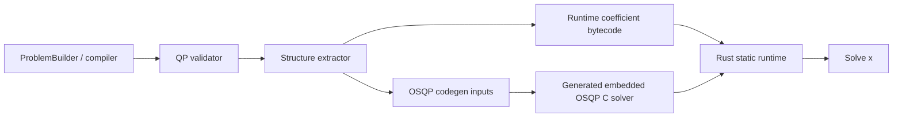

# OSQP integration plan

## Goal

Add a QP solver path to the Rust runtime that preserves the runtime's static-workspace execution model.

## Non-negotiable constraints

- No runtime heap allocation in the solver path.
- The Rust runtime stays responsible for evaluating problem data from bytecode.
- OSQP is used in its embedded/code-generated configuration, not through a dynamically allocating generic wrapper.
- Once an optimisation problem is generated, we do **not** change sparsity in the bytecode. Only numeric values may change at runtime.

## Problem class

Target problems are quadratic programs of the form:

$$
\min_x \; \tfrac12 x^T P x + q^T x
$$

subject to

$$
l \le A x \le u
$$

with optional runtime parameters $p$ affecting the numeric values in $P$, $q$, $A$, $l$, and $u$.

## Fixed-structure rule

This integration assumes a fixed structural problem after compilation:

- decision dimension is fixed
- constraint dimension is fixed
- sparsity pattern of `P` is fixed
- sparsity pattern of `A` is fixed
- bytecode workspace layout is fixed

Runtime updates may change values only:

- `Px` values for the upper-triangular nonzeros of `P`
- `Ax` values for the nonzeros of `A`
- `q`
- `l`
- `u`
- warm-start vectors

This matches OSQP embedded/code-generated usage and keeps the runtime statically sized.

## High-level architecture



## Compiler work

### 1. Add a QP-only lowering path

Introduce a dedicated build path beside the existing nonlinear optimisation backends.

Required checks:

- objective must be quadratic in decision variables
- constraints must be affine in decision variables
- dimensions must be fully known at compile time

The existing degree logic in the Python optimisation stack is the right starting point for this validation.

### 2. Split structure from values

The compiler should emit two artifacts:

1. **Structural QP metadata**
   - dimensions
   - CSC sparsity of `P`
   - CSC sparsity of `A`
   - variable/constraint ordering
   - output mapping

2. **Runtime coefficient evaluators**
   - bytecode programs that fill numeric buffers for `Px`, `Ax`, `q`, `l`, and `u`

The important rule is that the bytecode computes values for an already-fixed sparsity pattern. It never adds or removes nonzeros after compile time.

### 3. Preferred extraction strategy

For each compiled QP:

- assign a stable flat ordering to decision variables
- normalize constraints to `l <= A x <= u`
- extract CSC column pointers and row indices once
- compile the corresponding value streams into bytecode evaluators

This gives the runtime a small, static contract:

- evaluate parameter-dependent coefficient values
- copy them into preallocated OSQP arrays
- call solve

## Runtime work

### 1. Solver wrapper

Add a small Rust wrapper around generated embedded OSQP C code.

The wrapper should own no heap-backed state. It should expose:

- solver dimensions
- nonzero counts
- update methods for `Px`, `Ax`, `q`, `l`, `u`
- warm start
- solve
- status extraction

### 2. Bytecode-driven coefficient updates

For parametric QPs, the runtime executes bytecode programs into caller-provided buffers:

- `px_workspace -> Px values`
- `ax_workspace -> Ax values`
- `q_workspace -> q`
- `l_workspace -> l`
- `u_workspace -> u`

Then it calls the corresponding OSQP update entry points.

### 3. Static memory layout

The runtime-side QP object should carry:

- embedded OSQP workspace
- coefficient buffers
- bytecode modules for coefficient evaluators
- scratch workspaces for those evaluators

Everything is pre-sized from compile-time metadata.

## Suggested Rust API

```rust
pub struct QpInfo {
    pub n: usize,
    pub m: usize,
    pub nnz_p: usize,
    pub nnz_a: usize,
    pub eval_workspace_size: usize,
}

pub struct StaticQp<'a> {
    pub info: QpInfo,
    // embedded OSQP solver state
    // coefficient evaluator bytecode
}

impl<'a> StaticQp<'a> {
    pub fn solve(
        &mut self,
        params: &[&[f32]],
        eval_workspace: &mut [f32],
        solution: &mut [f32],
    ) -> Result<SolveStatus, SolveError>;
}
```

## Build pipeline

### Fixed QP

For fully constant QPs:

1. compile Coker problem
2. extract `P`, `q`, `A`, `l`, `u`
3. run OSQP codegen
4. compile generated C into the Rust crate
5. solve without any coefficient re-evaluation

### Parametric QP with fixed sparsity

1. compile Coker problem
2. extract fixed sparsity for `P` and `A`
3. compile bytecode programs for coefficient values
4. run OSQP codegen for the fixed structure
5. at runtime, evaluate values and update OSQP buffers before each solve

## Status and outputs

The runtime should map OSQP status into Coker solve info:

- solved
- solved inaccurate
- max iterations reached
- primal infeasible
- dual infeasible
- time limit / interrupted
- non-convex / setup failure

Outputs should include at minimum:

- primal solution `x`
- objective value [INFERENCE]
- solve status
- iteration count [INFERENCE]

## Verification plan

1. Compiler rejects non-QP problems.
2. Fixed-QP example solves to the same result as the NumPy/CasADi reference path.
3. Parametric-QP example updates values without rebuilding structure.
4. Repeated solves reuse the same OSQP workspace.
5. Embedded/no-std build proves the runtime side stays allocation-free.

## Notes

- The generic Rust `osqp` crate is not the right deployment target for this path if strict static allocation is required.
- The embedded/code-generated OSQP path is the right fit because it assumes fixed dimensions and fixed sparsity.
- The fixed-sparsity rule is a feature, not a limitation: it keeps the runtime simple, predictable, and statically sized.
